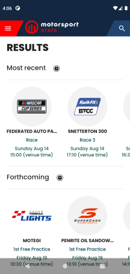

## MSS Android app

Sample Android app implementing part of the mobile [https://motorsportstats.com](https://motorsportstats.com).

### Tech stack:

* **UI:** Jetpack Compose
* **DI:** Dagger Hilt
* **Network:** Retrofit
* **Tests:** JUnit 5 + AssertJ + Mockk

See [Deps.kt](buildSrc/src/main/kotlin/Deps.kt) for the full list of dependencies.

### What's implemented

* Multiple screens of data with dynamic page loading
* Navigation between different screens
* Light and dark themes
* Localized date formatting
* All network interaction is covered with tests to check API compatibility

### Preview

Application in action can be seen in this [video](https://youtu.be/EFqIX46AprE).

&nbsp;&nbsp;
&nbsp;&nbsp;
&nbsp;&nbsp;
&nbsp;&nbsp;

